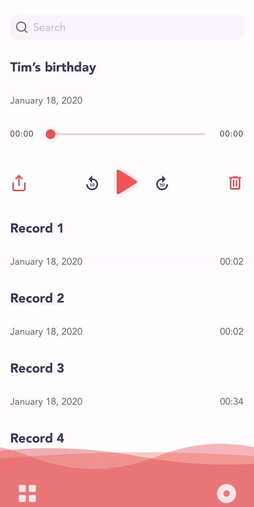

# React Native Store Rate

Show a popup asking for ratings or feedback. Show real in app (*or open store*) rating if users gave 5 stars.



## Installation

1. Install this package
    ```bash
    yarn add @hadx/react-native-store-rate
    ```

    OR

    ```bash
    npm install --save @hadx/react-native-store-rate
    ```

2. Install [react-native-rate](https://www.npmjs.com/package/react-native-rate#getting-started)

## Basic Usage

```tsx
import StoreRatePopup from '@hadx/react-native-store-rate';

const [visible, setVisible] = useState(true);

<StoreRatePopup
  primaryColor="#ff6a69"
  rateOptions={{
    AppleAppID: '1462815590',
    GooglePackageName: 'com.mywebsite.myapp',
  }}
  onFeedbackSubmit={feedback => setVisible(false)}
  visible={visible}
  onCancelPress={() => setVisible(false)}
/>
```